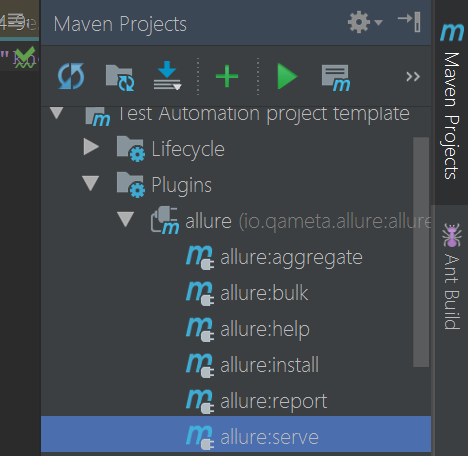

# Introduction
## Simple JDI examples
### 1. Create simple Login test
For the beginning I would like to show you how tipycal problems can be solved with JDI. Let's start from Login, most of the tests starts from this you need to login on site.
Java code example can be found here: https://github.com/jdi-examples/jdi-introduction

Test Scenario
------
1) Open test site (https://epam.github.io/JDI/index.html)
2) Login as user
* Enter 'epam' in login textfield
* Enter '1234' in password textfield
* Press 'Enter' button
3) Validate that HomePage id openned

```java 
@Test
public void loginTest() {
    homePage.open();
    userIcon.click();
    loginForm.loginAs(DEFAULT_USER);
    homePage.checkOpened();
}
```
So simple!
But this is not all, just Run this test in your IDE and what you will get?
1. Detailed log in Console output:

```
[22:17.102  STEP] : Open 'Home Page'(url=https://epam.github.io/JDI/index.html)
[22:23.617  STEP] : Click on 'User Icon'
[22:23.727  STEP] : Login as User(userName:epam; password:1234)
[22:24.516  STEP] : Check that 'Home Page' is opened (url CONTAINS '/index.html'; title EQUALS 'Home Page')
```
**Nice!** Isn't it? :ok_hand:

2. Same log in log file (src/test/.logs/) if you would like to see test execution results remotely (require log4j2.xml in src/test/resources)
3. Nice Allure report of your test execution! (require Allure settings in pom.xml)


Just move allure-results folder in target folder adn run maven > Plugins > allure > allure:serve


### 2. UI PageObjects
So now let's look on PageObjects we have in JDI. In example above for "Login test" we have following PageObjects:
* Site - entity for your application. Consist of list of Pages you have in application

```java 
@JSite("https://epam.github.io/JDI/")
public class JdiTestSite {
    public static HomePage homePage;
}
```
* HomePage - Pages collects elements: common, complex and composite. Pages already have meta information about Url and Title and you can execute common actions with this Pages like: open, checkOpenned, get Url/Titile, zoom, scroll, work with cookies etc.

```java 
@Url("/index.html") @Title("Home Page")
public class HomePage extends WebPage {
    @Css("form") public static LoginForm loginForm;
    @Css("img#user-icon") public static Icon userIcon;
}
```
* LoginForm - Forms and Sections are logical parts of pages, they can include other sections or just elements. Forms also have additional actions like fill, submit, check etc.

```java 
public class LoginForm extends Form<User> {
    @Css("#name") TextField userName;
    @Css("#password")  TextField password;
    @Css("[type=submit]") Button enter;
}
```
* UI elements (Typified elements) like Button, TextField, Checkbox, Icon etc. - simple elements that represents real elements on UI


This is common JDI project structure


## Start new project with JDI
## How to improve your Selenium project with new capabilities in few minutes
## Logging and Reporting
